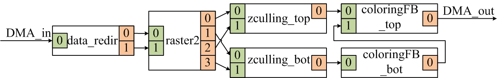

# Direct Wires Parallel Mapping
Direct Wires (DW PRFlow) is a framework that allows FPGA developers to map their 
applications by using existed PRflow framework, but without NoC bandwidth limitations.

### How DW prflow works?
We quantize the MPSoC Fabrics into coarse-grained blocks as the figure below.
The application is coposed of operators, which are connected by streaming
interfaces.

 

When we map the application, the operators will be mapped to the separated
gridded fabrics. We will take the dataflow graph below as an example (rendering).

 


 
We describe the physical pages and operators replationship in [input_files/hls_src/rendering/architecture.xml](input_files/hls_src/rendering/architecture.xml).

```c
  <!--functions to be synthesized-->
  <function name = "data_redir_m"          inputs = "1" outputs = "2" page = "X2Y3"  ramtype = "block"/>
  <function name = "rasterization2_m"      inputs = "2" outputs = "4" page = "X3Y3"  ramtype = "block" />
  <function name = "zculling_top"          inputs = "2" outputs = "1" page = "X2Y4"  ramtype = "block"/>
  <function name = "zculling_bot"          inputs = "2" outputs = "1" page = "X3Y4"  ramtype = "block"/>
  <function name = "coloringFB_top_m"      inputs = "2" outputs = "1" page = "X2Y5"  ramtype = "block"/>
  <function name = "coloringFB_bot_m"      inputs = "1" outputs = "1" page = "X3Y5"  ramtype = "block"/>
```

Based on the physical mapping, we describe the interconnection information in 
[input_files/hls_src/rendering/architecture.xml](input_files/hls_src/rendering/architecture.xml)
as well.

```c
  <!--functions connections-->
  <link source = "DMA.0-X1Y3-data_redir_m.0"                         width = "128"/>
  <link source = "data_redir_m.0-rasterization2_m.0"                 width = "32"/>
  <link source = "data_redir_m.1-rasterization2_m.1"                 width = "32"/>
  <link source = "rasterization2_m.0-X3Y4-zculling_top.0"            width = "32"/>
  <link source = "rasterization2_m.1-zculling_bot.0"                 width = "32"/>
  <link source = "rasterization2_m.2-X3Y4-zculling_top.1"            width = "32"/>
  <link source = "rasterization2_m.3-zculling_bot.1"                 width = "32"/>
  <link source = "zculling_top.0-coloringFB_top_m.0"                 width = "32"/>
  <link source = "zculling_bot.0-coloringFB_bot_m.0"                 width = "32"/>
  <link source = "coloringFB_bot_m.0-coloringFB_top_m.1"             width = "128"/>
  <link source = "coloringFB_top_m.0-X3Y5-X3Y4-X3Y3-X2Y3-X1Y3-DMA.0" width = "128"/>
```


## 1. Getting Started
```
$ git clone https://github.com/RC4ML/Shuhai.git
$ git submodule update --init --recursive
```

## 2. Build FPGA Project
```
$ cd hw/
```
According to hw/README.md, build vivado project and program the FPGA with the generated bitstream. 

## 3. Build Software Project
```
$ cd sw/
```
According to sw/README.md, build the software project and run the application


## Frequently Asked Questions
1, Q. the machine failed to detect PCIe on the FPGA when loading the kernel module.

   A. Connect the JTAG to another machine that will not crash when downloading the FPGA image. It means that you cannot use the same machine to load the bitstream. 


## Cite this work
If you use it in your paper, please cite our work ([full version](https://ieeexplore-ieee-org.proxy.library.upenn.edu/document/9415587)).
```
@inproceedings{xiao2020fast,
  title={Fast Linking of Separately-Compiled FPGA Blocks without a NoC},
  author={Xiao, Yuanlong and Ahmed, Syed Tousif and DeHon, André},
  booktitle={2020 International Conference on Field-Programmable Technology (ICFPT)},
  volume={},
  number={},
  pages={196-205},
  doi={10.1109/ICFPT51103.2020.00035}
}

```
### Related publications
* Yuanlong Xiao, Syed Tousif Ahmedand, and Adnr\'e DeHon}. [Fast Linking of Separately-Compiled FPGA Blockswithout a NoC](doc/xiao2020fast.pdf). ICFPT, 2020.


